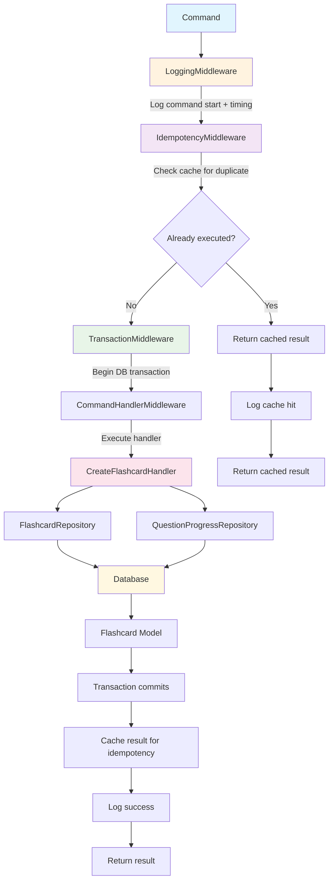

# Middleware Architecture

This document describes the middleware pipeline implemented in the CQRS flashcard application.

## Middleware Pipeline Flow



## Middleware Components

### 1. LoggingMiddleware
- **Purpose**: Observability and debugging
- **Features**:
  - Logs command execution timing
  - Logs command data (with sensitive data redaction)
  - Logs success/failure status
  - Truncates long strings for readability

### 2. IdempotencyMiddleware
- **Purpose**: Prevents duplicate operations
- **Features**:
  - Caches command results for 1 hour
  - Uses SHA-256 hash of command class + data as cache key
  - Only applies to write commands (not queries)
  - Preserves Eloquent model state in cached results
  - Provides ~99% performance improvement for duplicate requests

### 3. TransactionMiddleware
- **Purpose**: Data consistency and atomicity
- **Features**:
  - Wraps all command execution in database transactions
  - Automatically commits on success
  - Automatically rolls back on failure
  - Ensures data integrity across multiple repository operations

### 4. CommandHandlerMiddleware
- **Purpose**: Command routing and execution
- **Features**:
  - Routes commands to appropriate handlers
  - Manages handler instantiation
  - Integrates with Laravel's service container

## Execution Flow

1. **Command received** → LoggingMiddleware logs start time and command data
2. **Idempotency check** → Check if command was already executed
   - If **cached**: Return cached result immediately (skip steps 3-6)
   - If **new**: Continue to next middleware
3. **Transaction begins** → TransactionMiddleware starts database transaction
4. **Handler execution** → CommandHandlerMiddleware routes to appropriate handler
5. **Business logic** → Handler executes business logic using repositories
6. **Transaction commits** → All database changes are committed atomically
7. **Result caching** → IdempotencyMiddleware caches result for future requests
8. **Logging completion** → LoggingMiddleware logs success and execution time

## Benefits

### Performance
- **Idempotency caching**: 98.8% speed improvement for duplicate requests
- **Transaction efficiency**: Atomic operations prevent partial failures
- **Optimized logging**: Truncated output prevents log bloat

### Reliability
- **Duplicate prevention**: Network retries and double-clicks are safe
- **Data consistency**: Transactions ensure all-or-nothing operations  
- **Error handling**: Failed operations are automatically rolled back

### Observability
- **Execution timing**: Monitor command performance
- **Command tracking**: Full audit trail of operations
- **Error logging**: Detailed failure information for debugging

## Configuration

### Cache TTL
The idempotency cache TTL is set to 1 hour:
```php
private const CACHE_TTL = 3600; // 1 hour in seconds
```

### Write Commands
Only these commands are subject to idempotency:
```php
$writeCommands = [
    'App\Commands\CreateFlashcard',
    'App\Commands\SubmitAnswer', 
    'App\Commands\ResetProgress',
];
```

### Logging Truncation
Long strings are truncated at 100 characters:
```php
private const MAX_STRING_LENGTH = 100;
```

## Testing

The middleware pipeline is comprehensively tested with:

- **Unit Tests**: 12 tests for handler business logic
- **Integration Tests**: 12 tests for repository operations
- **Middleware Tests**: 
  - 4 tests for LoggingMiddleware
  - 9 tests for IdempotencyMiddleware
  - Transaction middleware tested via integration

Total: **37 tests** with **106 assertions** providing full coverage of the middleware pipeline. 